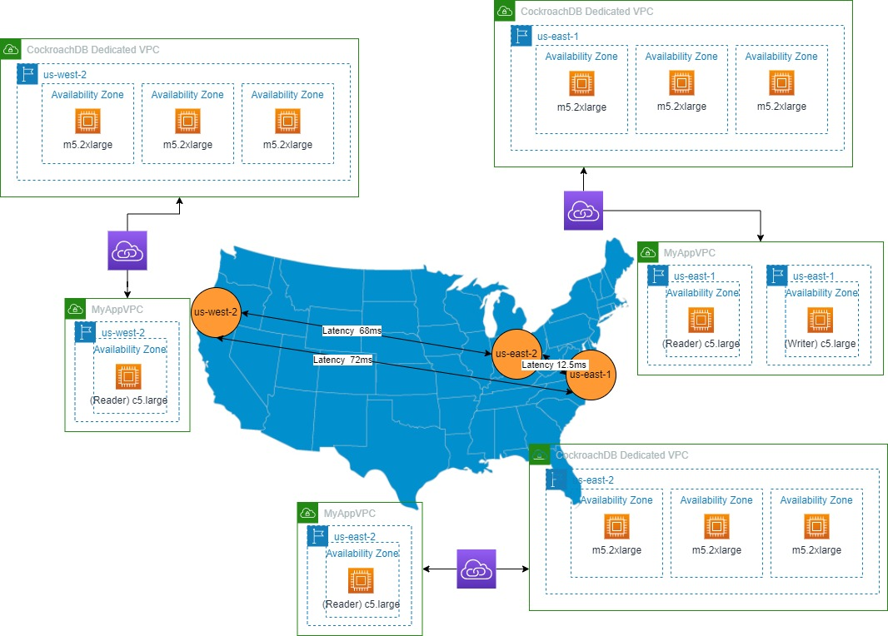

# Global Table Performance
Attempting to profile CockroachDB Global Table performance as the number of writes is increased.

# Topology
The basic topology of this simple benchmark is a CockroachDB Cluster made up of 3 Regions in AWS:
- us-east-1
- us-east-2
- us-west-2

Each region consists of 3 nodes, each node in a different AZ.  The compute is 8vCPU per node and the storage is 300GiB per node.

There is one global table in the default db.  
- In the insert exercise, the table has 100,000 rows to start.  
- In the update exercise, the table as 10 rows.  Never more or less.

# The Readers and Writer
There are two different types of excercises that can be measured:
- Inserts - The writer is writing to the global table at the same time the readers are attempting to read records however, the readers are reading existing records.  There are no collisions between the readers and writers.
- Updates - In this scenario, there are only 10 records in the global table.  The readers are reading all 10 records in every pass.  The writer is updating a single record (round robin) in the group of 10 records with every write.  This forces collisions between the readers and writers.

## Insert Exercise
In the "Insert Exercise", the Global Table starts with 100,000 rows.  The readers read in the PK of all 100,000 rows and randomizes the list.  At that point, the readers will continually read from the Global Table by PK until the script is killed.  The readers emit information to a log file with an average latency of the last 100 reads.

The writer, will start by writing a row to the Global Table and then sleep for 1,000 ms.  The writer will continue to write at that rate for a given amount of time (configurable with an argument to the script) and then will decrease the sleep time by 100ms (much like a step function).  The writer will continue to decrease the sleep time until the sleep time reaches zero.  The writer emits a record to the log file each time sleep time decreases indicating the number of inserts and the average latency for the writes during that segment.

There is never a collision in the rows the readers are reading and the rows the writer is writing.

## Update Exercise.
In the "Update Exercise", the Global Table starts with only 10 rows.  The readers continually read all 10 rows in the table, as fast as they can, until the script is cancelled.  The readers emit information to a log file with an average latency of the last 100 reads.   The latency of the reads includes fetching the 10 records. 

The writer starts by reading the PK of all 10 rows into a list and then updating a field in the table with a random value.  The writer follows the same pattern as in the "Insert Excercise"; update a single row in the table and then sleep for 1,000ms.  It will continue that pattern for a given about of time before decreasing the sleep time by 100ms.  The writer will continue to decrease the sleep time until the sleep time reaches zero.  Each time the sleep cycle is shortened a record will be emitted to 

# Readouts
Once the Exercise (either the Insert or Update) is complete, the log files are loaded into the database and some analytics are run.

See the readouts [here](results_readout.md)