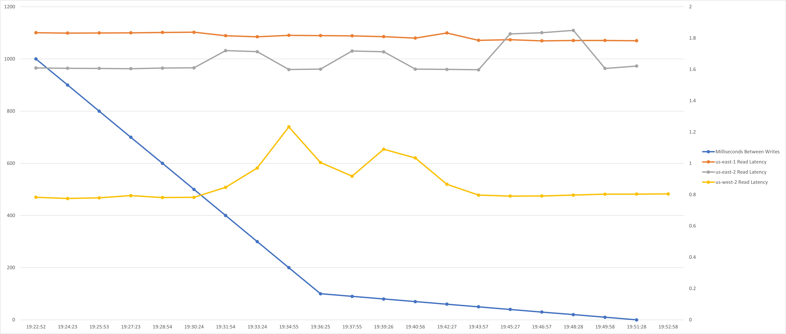
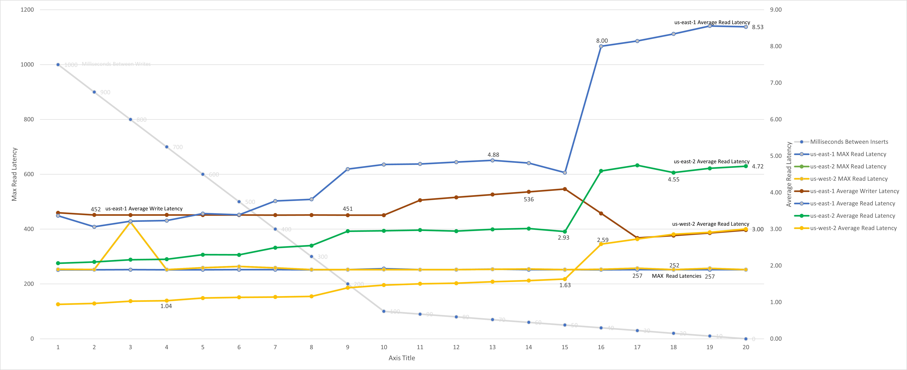

# Database Regions
```
     region     |                     zones                      | database_names | primary_region_of
----------------+------------------------------------------------+----------------+--------------------
  aws-us-east-1 | {aws-us-east-1a,aws-us-east-1b,aws-us-east-1c} | {defaultdb}    | {defaultdb}
  aws-us-east-2 | {aws-us-east-2a,aws-us-east-2b,aws-us-east-2c} | {defaultdb}    | {}
  aws-us-west-2 | {aws-us-west-2a,aws-us-west-2b,aws-us-west-2c} | {defaultdb}    | {}
```

# Table Definition
```
show create table global_table_test;
     table_name     |                         create_statement
--------------------+--------------------------------------------------------------------
  global_table_test | CREATE TABLE public.global_table_test (
                    |     id UUID NOT NULL DEFAULT gen_random_uuid(),
                    |     create_time TIMESTAMPTZ NOT NULL DEFAULT now():::TIMESTAMPTZ,
                    |     rowid INT8 NOT NULL DEFAULT unique_rowid(),
                    |     worker VARCHAR(50) NOT NULL,
                    |     cluster_node INT8 NOT NULL,
                    |     gateway_region VARCHAR(50) NULL,
                    |     gateway_az VARCHAR(50) NULL,
                    |     lease_holder INT8 NULL,
                    |     int8_col INT8 NULL,
                    |     varchar50_col VARCHAR(50) NULL,
                    |     bool_col BOOL NULL,
                    |     jsonb_col JSONB NULL,
                    |     CONSTRAINT glbal_table_test_pkey PRIMARY KEY (id ASC)
                    | ) LOCALITY GLOBAL
(1 row)

```
# Insert Excercise
In the insert exercise the readers in each region are reading as fast as they can from the Global Table.  The writer is writing a record and then sleeping for 1000ms; every 90 seconds the amount of sleep time is reduced by 100ms until the writer is writing as fast as it can.  

There is no overlap (or contention) between the readers and writer.  

The insert exercise was not meant to stress the Cockroach Database.  It was meant strictly to see if, as the number of writes on a global table increases, the latency of reads decreases. In this exercise there is no overlap between the records being read and the records being written.

The maximum number of records being inserted in a 90second period was about 225 or about 2.5 records per second.

The average latency of reads did not change throughout the test.  It is my opinion that at this scale, the number of writes to a Global Table does not impact the reads as long as there is no conflict between the reads and writes.


The raw results in log files are available
- [reader output us-east-1](logfiles/Insert_Exercise/reader_output_use1.log)
- [reader output us-east-2](logfiles/Insert_Exercise/reader_output_use2.log)
- [reader output us-west-2](logfiles/Insert_Exercise/reader_output_usw2.log)
- [writer output us-east-1](logfiles/Insert_Exercise/writer_output.log)

# Update Exercise
In the update exercise the readers in each region are reading all 10 records in the Global Table as fast as they can.  The writer is updating a record and then sleeping for 1000ms; every 90 seconds the amount of sleep time is reduced by 100ms until the writer is writing as fast as it can.  

There is constant overlap between the readers and writers.

It looks like the maximum number of records that can be updated by the write is about 225 or about 2.5 records per second.



Between 50ms sleep time and 40ms sleep time for writes the impact to the readers is very dramatic.  The read latencies basically double when when the sleep time decreases between 50ms and 40ms.  

What we need to take notice of, is the "MAX Latencies" on the graph above.  The average latencies mask the MAX Latencies that the readers experience when waiting for the writer to complete work.  As the readers hit more and more contention from the readers, the average does increase.  

There is a lot of information on the graph making it difficult to interpret.  

- The left hand scale is used for the Average Write Latency and the Max Read Latencies.
- The right hand scale is used for the Average Read Latencies.

The raw results in log files are availble
- [reader output us-east-1](logfiles/Update_Exercise_3/reader_output_use1.log)
- [reader output us-east-2](logfiles/Update_Exercise_3/reader_output_use2.log)
- [reader output us-west-2](logfiles/Update_Exercise_3/reader_output_usw2.log)
- [writer output us-east-1](logfiles/Update_Exercise_3/writer_output_use1.log)

The [Excel File](xls/results.xlsx) contains the graphs and the data used to created the graphs.